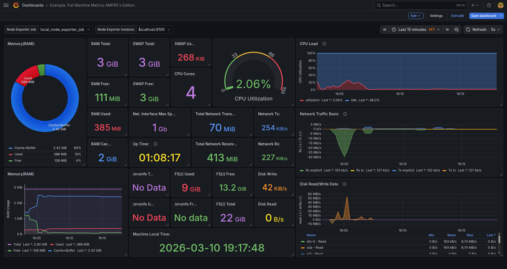

**On grafana home page click the burger icon next to grafana logo:**

**Click on `Dashboards` Then `New` on the top right:**

**Click `Import`:**

**Chose your method:** in my case i had the row `json` so i just pasted it in the box.

**Choose your data source which is `prometheus` in this case:**

**Click `Import`:**

**Result in my case:** you can find this dashboard in the examples folder.
