# Resources:
[Introduction to raspberry pi 5 setup video](https://www.youtube.com/watch?v=ZH6vfvRstfM&t=1021s)
[Enable VNC Remote Desktop Video](https://www.youtube.com/watch?v=PJqTRuxkL1Q)
[Protect SD Card From Corruption Video](https://www.youtube.com/watch?v=LKDC-Wjukk0)
[Raspberry Pi 5 Bios and RTC battery install Video](https://www.youtube.com/watch?v=QeajO1ketZ4)
[Build a Kiosk with Raspberry Pi Video](https://www.youtube.com/watch?v=J3gOWauVjwM)
[Build a Kiosk with Raspberry Pi Web Guide](https://www.raspberrypi.com/tutorials/how-to-use-a-raspberry-pi-in-kiosk-mode/)
[Install Raspberry Pi Metal Case Video](https://www.youtube.com/watch?v=tWb03sZk4lI)

---
# 1. Raspberry Pi OS installation:

[Introduction to raspberry pi 5 setup video](https://www.youtube.com/watch?v=ZH6vfvRstfM&t=1021s)

**1.1. Download Raspberry Pi Imager - [Click To Download Raspberry Pi Imager](https://www.raspberrypi.com/software/).**

**Click `Software` on the top:**

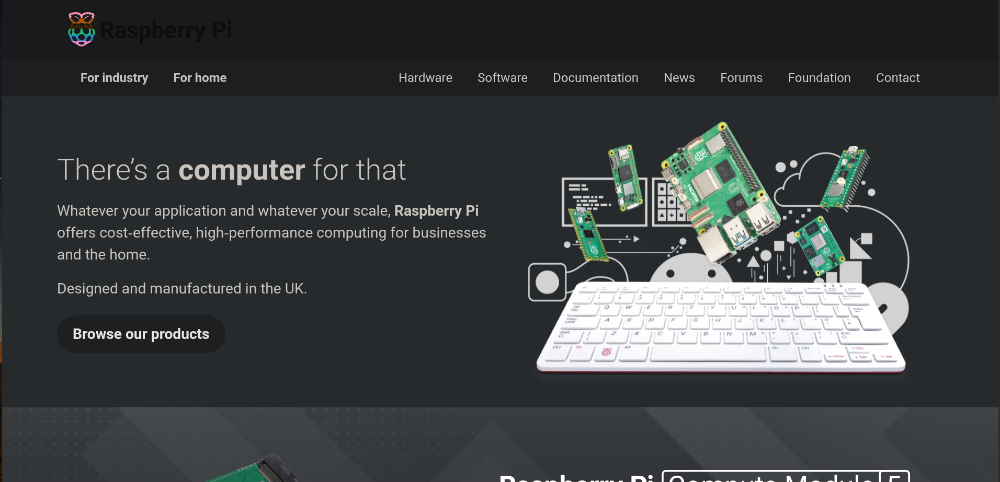

**Scroll down and click download for you operating system:**

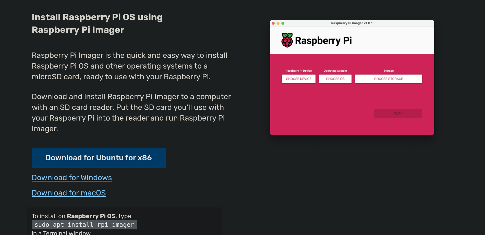

**1.2. Insert the SD card in the `USB Reader` or just insert it in your device if it supports that.**

>Note: All data on the SD card will be deleted.

>Note: Remove any other USB storage device so that you won't delete anything accidentally.

**1.3. Install  the raspberry pi `Imager`:**

**1.4.  Create bootable SD-card for the `Raspberry  Pi 5`:**

**Open `Imager`:**

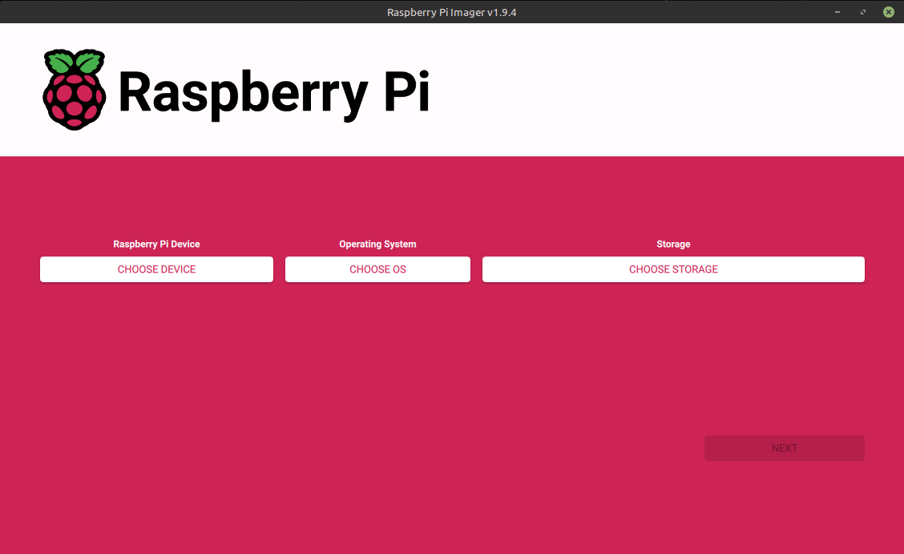

**Click `Choose Device` then `Raspberry Pi 5`:**

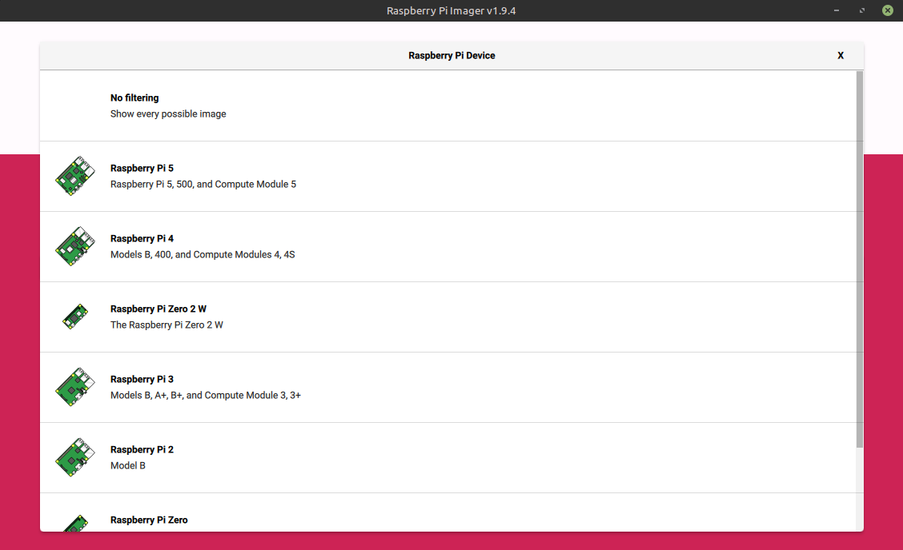

**Click `Choose OS` then `Raspberry Pi OS (64-bit)`:**

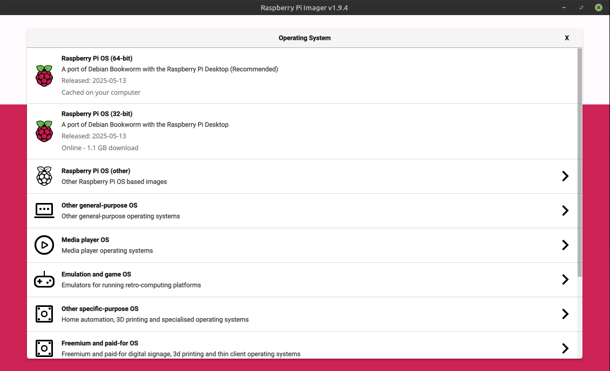

**Click `Choose Storage` then select your SD-card:**

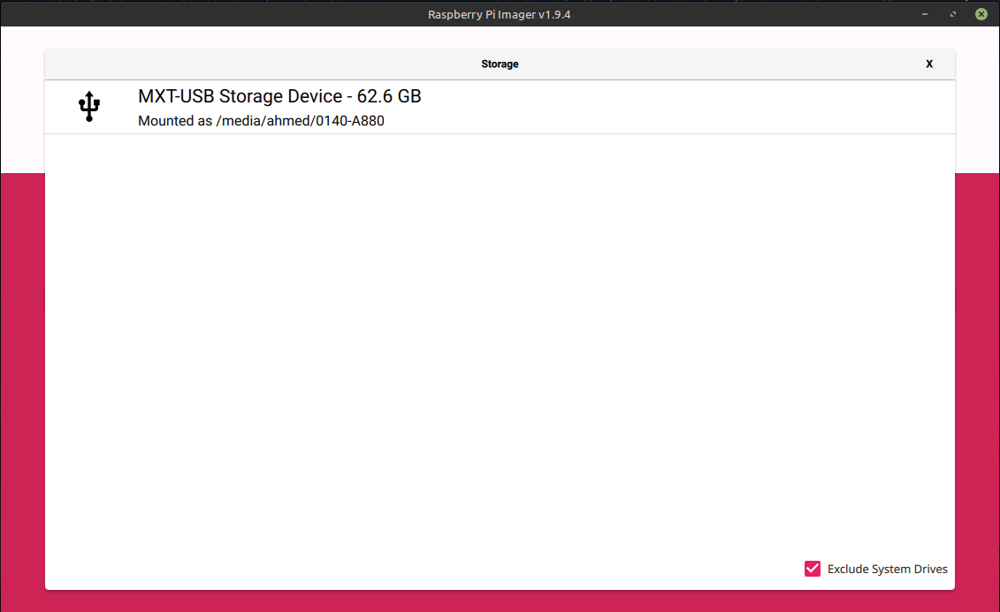

**Click `NEXT`:**

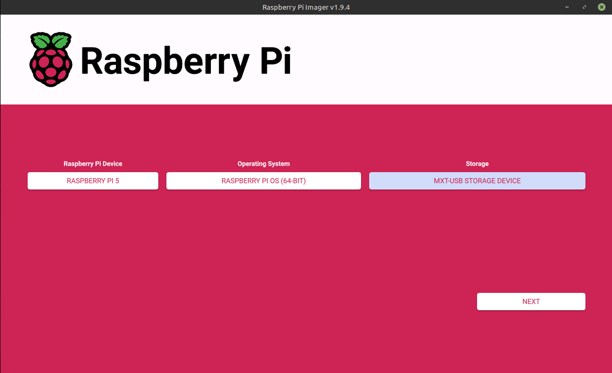

**Click `EDIT SETTINGS`:**

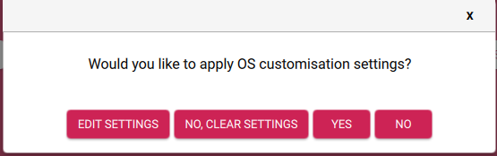

**Under `General` enter your credentials:**

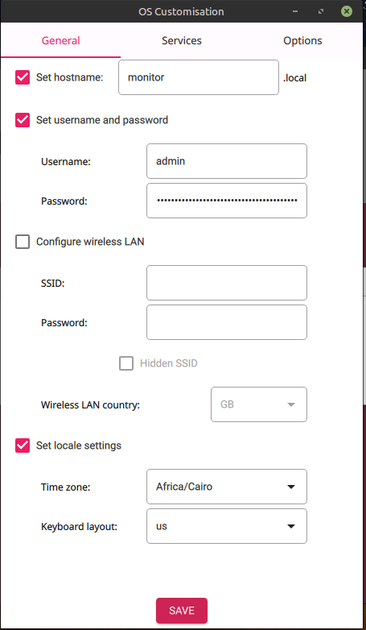

**Under `Services` check `Enable SSH`: then click `SAVE`:**

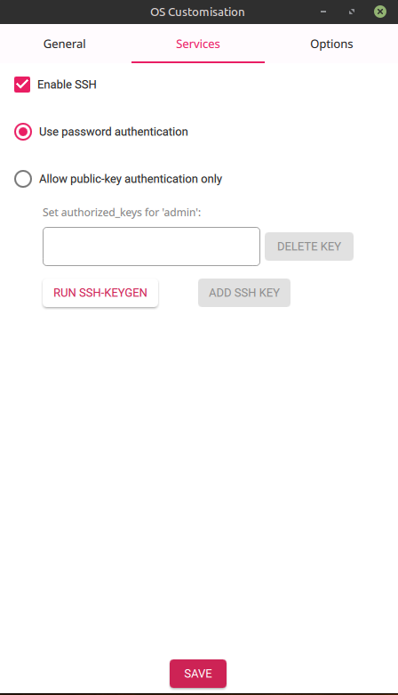

**Click `YES`:**


**Click `YES`:**

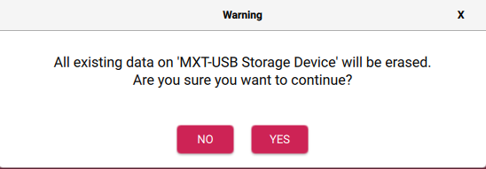

**If this is the first time the `Raspberry Pi OS` will be downloaded and it wold display `Waiting` then `Writing`:**

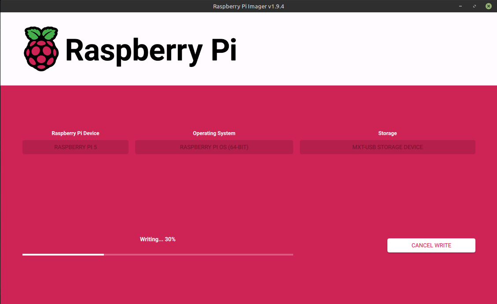

**Verifying:**

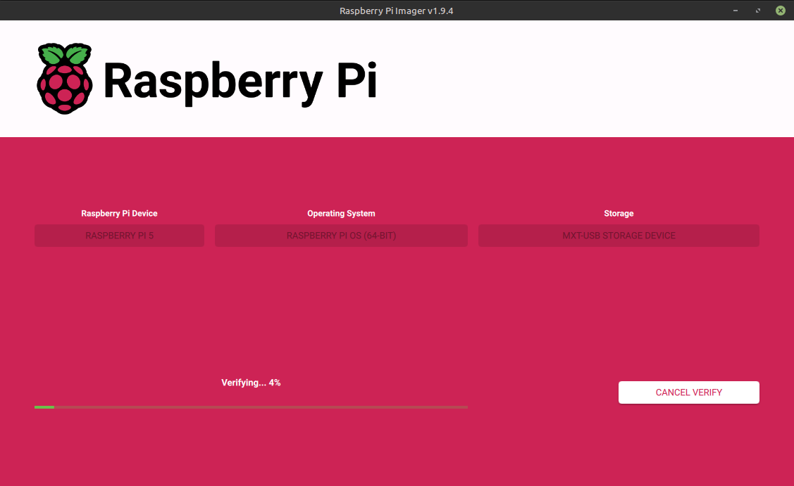

**Success:**

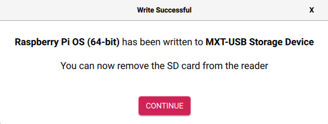

> Now you can remove the SD-card and insert it into the `Raspberry Pi`.

---
---
# 2. Setting Up Raspberry Hardware:

[Install Raspberry Pi Metal Case Video](https://www.youtube.com/watch?v=tWb03sZk4lI)

**2.1. Install the metal aluminium case for the Raspberry Pi 5.**

**2.2. Insert the SD card that has Raspberry Pi OS on it in the Raspberry Pi.**

**2.3. Connect the micro-hdmi to hdmi cable between the Raspberry Pi and your screen, power, keyboard, mouse, exthernet, and the RTC battery case.**

---
---
# 3. Raspberry Pi Configs:

>After you boot into the Raspberry Pi OS, a window will appear asking you for some credentials like username, password and some other configs if you have already set them.

---
#### 3.1. Basics:

**3.1.1. Update/upgrade the Raspberry Pi OS**

> **Important for all of the coming steps.**

```bash
sudo apt update && sudo apt upgrade
```

---

**3.1.2. Modify commands history size and time stamp:**

> 1000 Commands.

```bash
echo 'export HISTTIMEFORMAT="%d/%m/%y %T "' >> ~/.bash_profile \
&& echo 'export HISTSIZE=10000' >> ~/.bash_profile \
&& echo 'export HISTFILESIZE=10000' >> ~/.bash_profile \
&& source ~/.bash_profile
```

---
**3.1.3. Install `vim`:(Optional)
```bash
sudo apt install vim
```

---
---
#### 3.2 Expand the root file system size:

**3.2.1. Open the terminal from the top left and enter the following command:**
```bash
raspi-config
```

**3.2.2. Choose `Advanced Options`-> `Expand Filesystem` -> `Finish` -> `OK` -> `Finish` -> `Yes`**

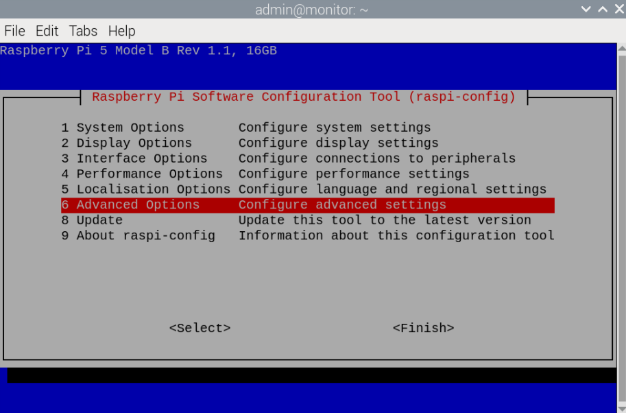

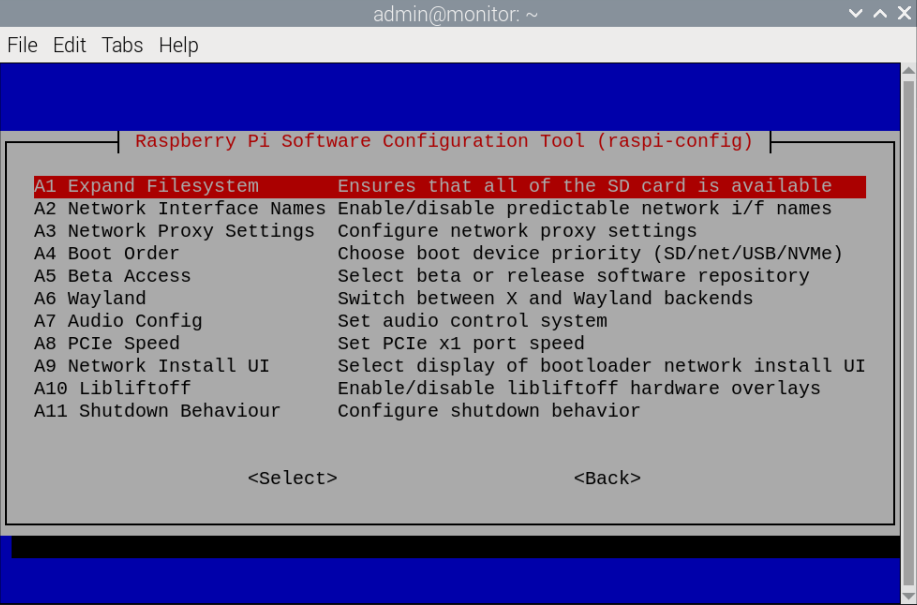

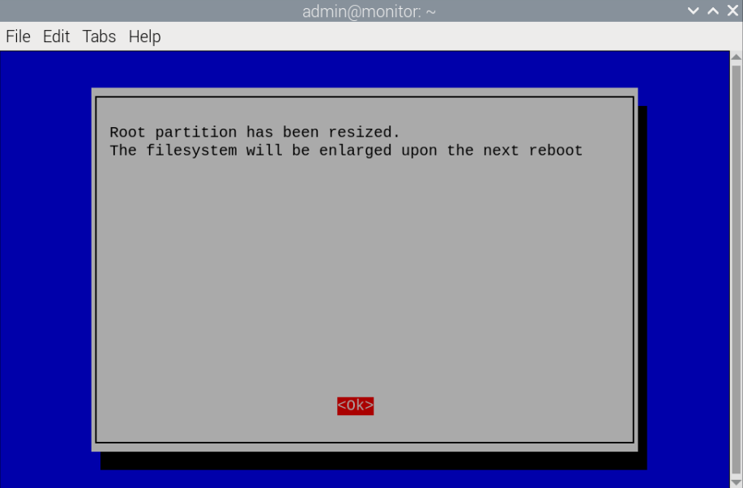

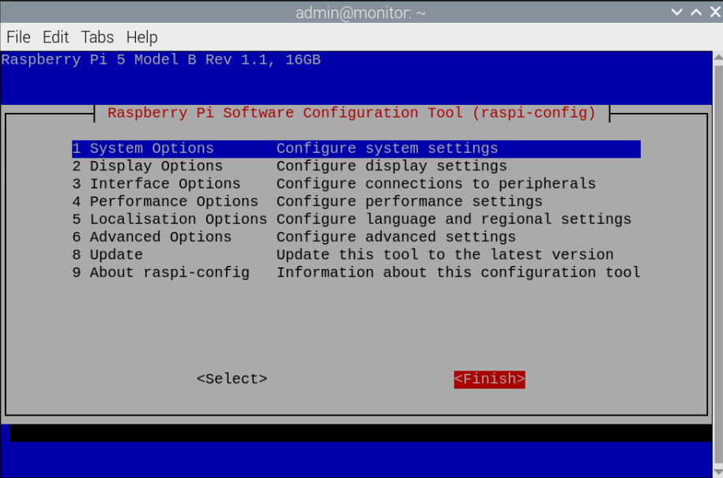

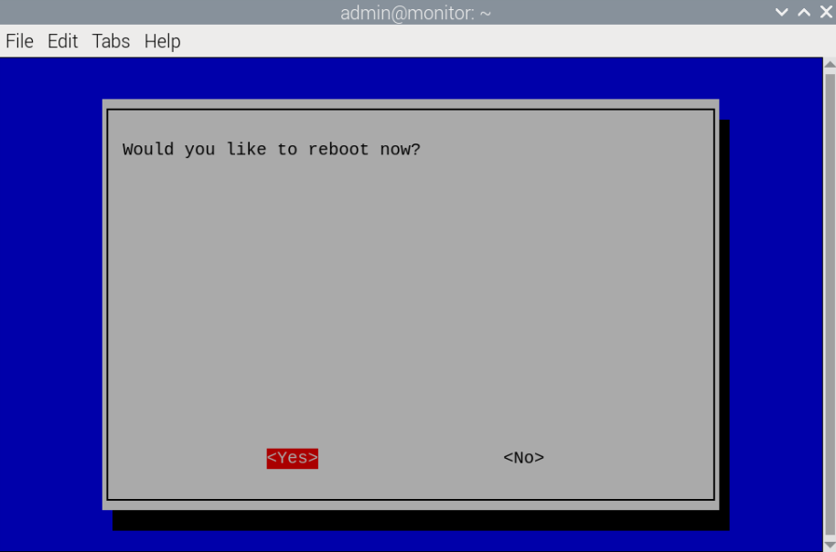

---
#### 3.3. Change SSH Port:

**3.3.1. Open the `/etc/ssh/sshd_config` file:**
```bash
vim /etc/ssh/sshd_config
```

**3.3.2. Uncomment `#Port 22` and add your desired port:**
```bash
# Port 22
Port <NEW_SSH_PORT>
```

---
#### 3.4. Enable SSH:(If you haven't during the SD-card Installation)

> Note: SSH can be enabled through `raspi-config` command `Interface Options` → `SSH` → **Yes** then reboot. 

**3.4.1. Click the` Raspberry Pi icon` on the top left.**

**3.4.2. Choose `Preferences`.**

**3.4.3. Click `Raspberry Pi Configuration`.**

**3.4.4. On the top par click on `Interfaces`.**

**3.4.5. Now activate SSH by toggling the `SSH` button.**

**3.4.6. Test if the new port works from your PC:**
```bash
ssh -p <NEW_SSH_PORT> pi@<RASPBERRY_PI_IP>
```

---
#### 3.5. Create new ssh rules in the firewall to restrict access:
**3.5.1. Firewall Rules:**
```bash
sudo ufw reset \
&& sudo ufw disable \
&& sudo ufw default deny incoming \
&& sudo ufw default allow outgoing \
&& sudo ufw allow from <YOUR_IP> to any port <RUST_DESK_PORT> proto tcp \
&& sudo ufw allow from <YOUR_IP> to any port 5900 proto tcp \
&& sudo ufw allow from <YOUR_IP> to any port 5353 proto udp \
&& sudo ufw deny ssh \
&& sudo ufw enable \
&& sudo ufw reload \
&& sudo systemctl restart sshd
```

**Explanation:**
```text
reset ufw
disable it so that new rules won't disconnect you accidentally.
deny incoming requests
allow outgoing requests
allow <YOUR_IP> to access <RUST_DESK_PORT> (remote desktop)
allow <YOUR_IP> to access VNC(5900) port (remote desktop)
allow <YOUR_IP> to access mdns(5353) port for easer access (EXP: pi.local)
make sure ssh default port 22 is closed 
reload ufw
restart the sshd service
```

or 

**Install `firewalld`:**
```bash
sudo apt -y install firewalld
```

**Check that its running and enabled:**
```bash
sudo systemctl status firewalld
```

**Start it if needed:**
```bash
sudo systemctl start firewalld
```

**Enable it if needed:**
```bash
sudo systemctl enable firewalld
```

**Run these commands:**
```bash
firewall-cmd --permanent --new-zone=SSH_ZONE \
&& firewall-cmd --permanent --zone=SSH_ZONE --add-source=<YOUR_IP> \
&& firewall-cmd --permanent --zone=SSH_ZONE --add-port=<RUST_DESK_PORT>/tcp \
&& firewall-cmd --permanent --zone=SSH_ZONE --add-port=<NEW_SSH_PORT>/tcp \
&& firewall-cmd --permanent --zone=SSH_ZONE --add-port=5900/tcp \
&& firewall-cmd --add-service=mdns --zone=SSH_ZONE \
&& firewall-cmd --permanent --zone=public --remove-service=ssh \
&& firewall-cmd --reload \
&& systemctl restart sshd
```

> Change `<NEW_SSH_PORT>` and `<YOUR_IP>`.

**Explanation:**
```text
create new zone: SSH_ZONE
add you IP to that zone
add the <RUST_DESK_PORT> to SSH_ZONE
add the <NEW_SSH_PORT> to SSH_ZONE
add VNC remote desktop port(5900) to SSH_ZONE
add mdns(5353) port to SSH_ZONE for easer access (EXP: pi.local)
remove ssh from puclic zone
reload firewalld
restart the sshd service
```

**3.5.2. Test if the new port works from your PC:**
```bash
ssh -p <NEW_SSH_PORT> pi@<RASPBERRY_PI_IP>
```

---
#### 3.6. Enable Remote Desktop:

**A) `RustDesk` Method(Universal Remote Desktop App):**

[Web Installation Guide Link](https://pi-apps.io/install-app/install-rustdesk-on-raspberry-pi/) 

> **Make sure you have already updated the `Raspberry Pi OS` with `sudo apt update`.**

**Install `Pi-Apps` extension:**
```bash
wget -qO- https://raw.githubusercontent.com/Botspot/pi-apps/master/install | bash
```

**Use `Pi-Apps` to install `RustDesk`:**

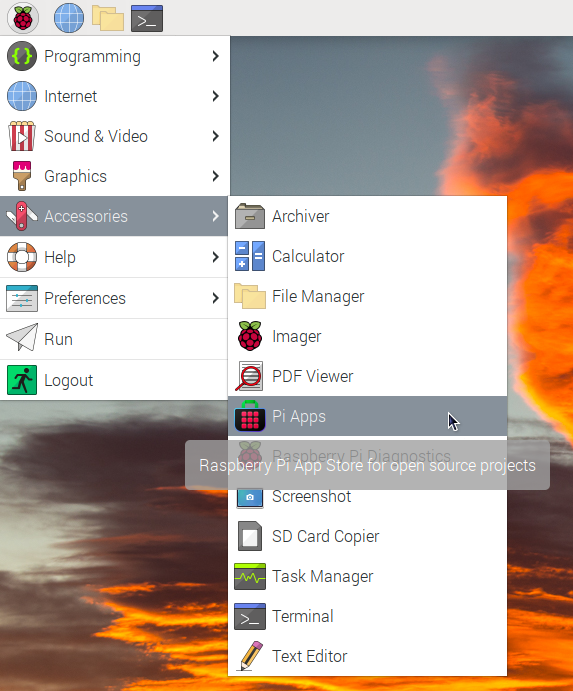

**Choose `Internet`:**

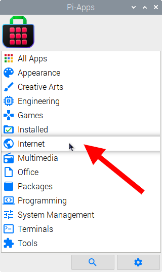

**Choose `RustDesk` then `Install`:**

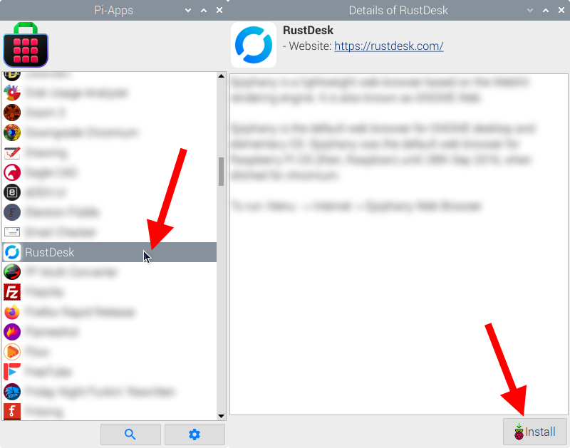

**Open RustDesk from `start menu` -> `Internet` -> `RustDesk`.**

**Click on the three dots next to the ID:**

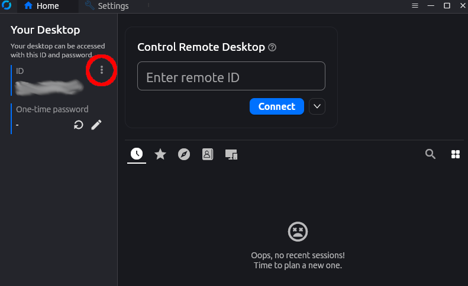


**On `General` scroll down and uncheck `Use texture rendering`:**

> Soves black screen problem.

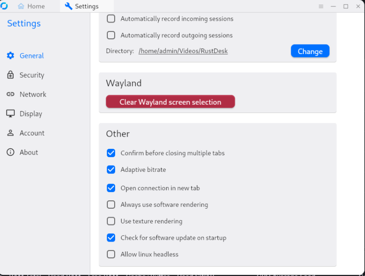


**Click on `Security`-> `Unlock security settings`:**

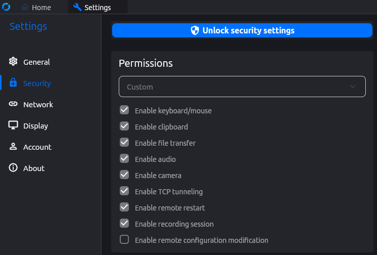

**Under the `Password` section select `Use permanent password`:**

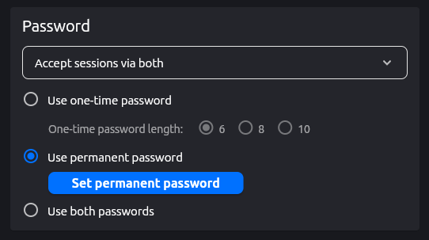

**Click `Set permanent password` , enter a strong password then click `OK` :**

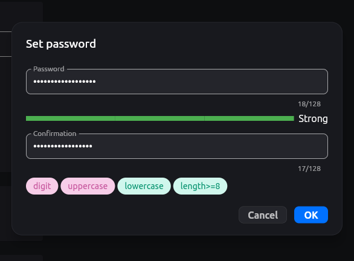

**Under security, choose `Enable direct IP access` and enter your desired port, default_port is `21118`:**

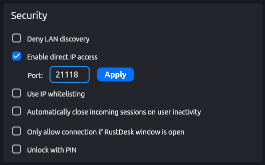

> RustDesk 1.4 doesn't fully support the `WayLand` GUI server.

**Switch GUI server to `X11` for better support and experience:**

```bash
sudo raspi-config
```


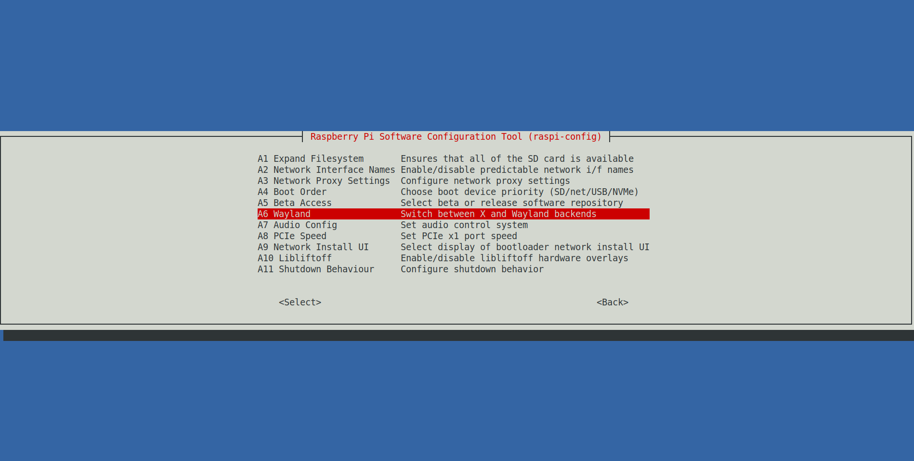

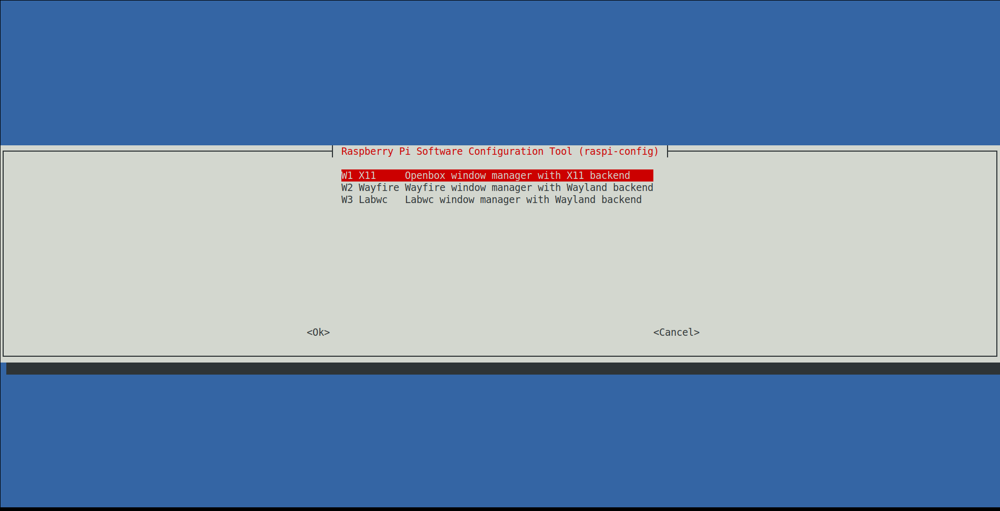

> **If you have two screens let them have same resolution.**

**Choose `Screen Configuration` at the bottom:**

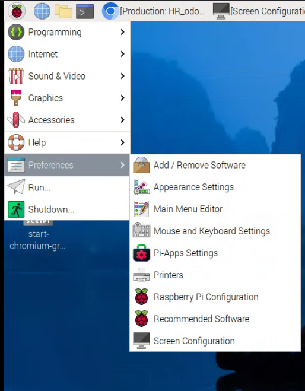

![[Services/monitoring/graphical-user-interface/monitoring-kiosk-screen-raspberry-passets/raspberry-pi-screen-resolution.png]]

---

**B) `VNC` Method(works best with LINUX):**

> Note: VNC can be enabled through `raspi-config` command `Interface Options` → `VNC` → **Enable** then reboot.

**3.6.1. Click the Raspberry Pi icon on the top left.**

**3.6..2. Choose `Preferences`.**

**3.6.3. Click `Raspberry Pi Configuration`.**

**3.6.4. On the top par click on `Interfaces`.**

**3.6.5. Now activate `VNC` by toggling the `VNC` `button`.**

**3.6.6. Reboot is recommended.

---
---
# 4. On your device:

**4.1. Download Rustdesk [click here](https://github.com/rustdesk/rustdesk/releases/tag/1.4.0) and install it according to your operating system.**

**4.2. Enter the IP of your remote device in `Enter remote ID` or `Control Remote Desktop` box then click `connect`.**

>If you change the default port: 10.0.0.20:PORT EXP:10.0.0.20:8914

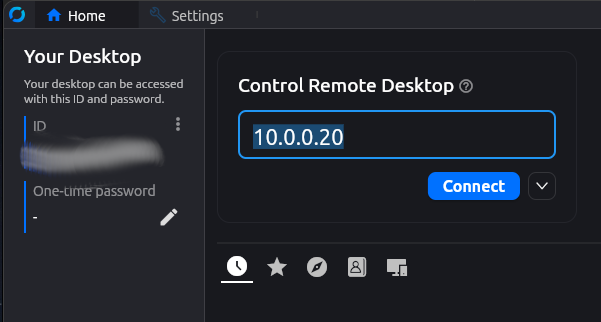

**4.3. Enter the password that you created on the remote desktop Rustdesk app:**

>Note: not physical machine user login password.

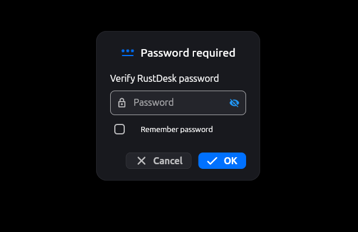

**Now enjoy using the Rapberry Pi remote desktop.**

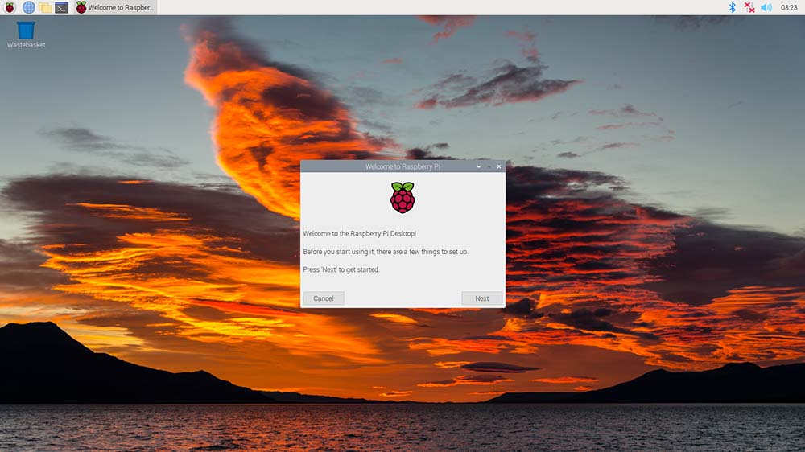

**Choose your screen setup:**

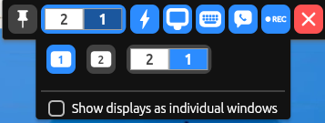


**To prevent the screen from sleeping under `X11` GUI:**
```bash
sudo nano /etc/xdg/lxsession/LXDE-pi/autostart
```

**Add the following:**
```bash
@xset s off
@xset -dpms
@xset s noblank
```

**Save and reboot:**
```bash
sudo reboot
```

---

**B) VNC Method(works best with LINUX):**

**4.1. Download VNC_viewer for your operating system [click here to download](https://www.realvnc.com/en/connect/download/?lai_vid=gxlpra2kdS1W&lai_sr=0-4&lai_sl=l).**

**4.2. Install it according to your operating system.**

**4.3. Open VNC_viewer and enter the *IP address, username and password* of the Raspberry Pi.**

**4.4. Now you can use the Raspberry Pi desktop from your computer.**


---
---
# 5. Auto Start Chrome With Desired Web Page:

**Kiosk mode:** `--kiosk`
>EXP: `chromium-browser --kiosk http://10.0.0.20:3000/dashboards`
>
>**To Escape kiosk mode hit  `Alt + F4` → closes the window on the remote machine itself.**

**Full screen mode:** `--start-fullscreen`
>EXP: `chromium-browser --start-fullscreen http://10.0.0.20:3000/dashboards`

**5.1. Manually test command:**
```bash
chromium-browser --start-fullscreen <DESIRED_WEB_PAGE_LINK>
```

```bash
chromium-browser --start-fullscreen raspberrypi.org
```

**5.2. Create `/home/pi/.config/autostart` if it doesn't exits:**
```bash
mkdir -p /home/pi/.config/autostart
```

**Create your auto start file to be executed:**
```bash
vim start-chromium-kiost.desktop
```

**Add the following:**
```bash
[Desktop Entry]
Type=Application
Exec=chromium-browser --noerrdialogs --disable-infobars --start-fullscreen <DESIRED_WEB_PAGE_LINK>
```

---
---

# 6. Reboot The Raspberry Pi And Test:
```bash
sudo reboot
```

---
---

# Google Authentication:

```bash
sudo apt update
sudo apt install libpam-google-authenticator -y
```

```bash
google-authenticator
```

```bash
sudo nano /etc/pam.d/sshd
```

**Add to the top with same order:**
```bash
auth requisite pam_unix.so try_first_pass
auth required pam_google_authenticator.so
```

```bash
sudo nano /etc/ssh/sshd_config
```


---
---
# 7. MAC address and IP Bond:

> Ask the Network administrators to:
> 
> 1. Bind the **Dynamic** IP of the Raspberry PI to its **MAC** address.
>
> 2. Create a security rule so that no one else can have the same IP address even manually(static IP). 

---
---
# 8. Data-center Firewall Rules:

> Ask the firewall administrators to let the Raspberry PI kiosk IP connect to the monitoring machine on port 3000(Grafana).

